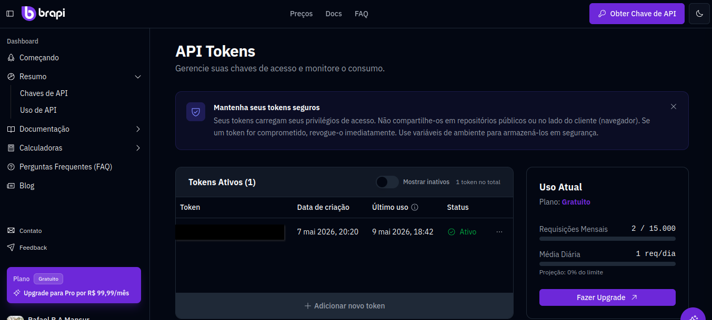
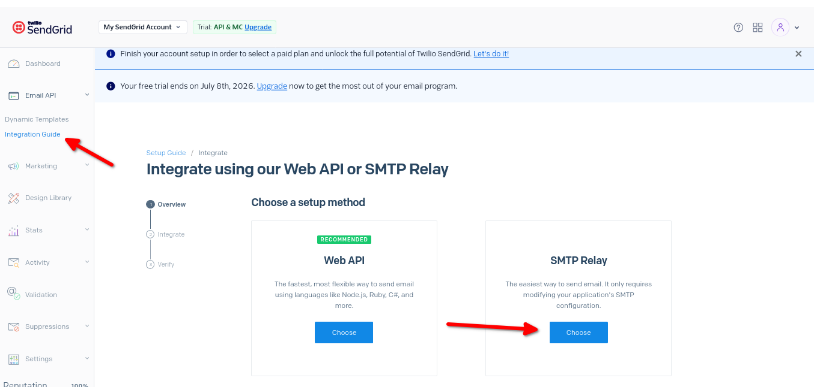

# StockMonitor

O **StockMonitor** é uma aplicação em C#/.NET que monitora a cotação de uma ação da B3 escolhida pelo usuário.

O programa consulta periodicamente o preço da ação e envia um alerta por e-mail quando o valor atinge o preço definido para compra ou venda.

## Funcionalidades

- Consulta de cotações da B3.
- Monitoramento de uma ação definida pelo usuário.
- Envio de alerta por e-mail.
- Término automático após horário de fechamento da B3
- Configuração por arquivo `ConfigFile.txt`.
- Geração de executável para Windows e Linux.

## APIs utilizadas

### Brapi

A API da **Brapi** é utilizada para obter os valores das cotações solicitadas.

No plano gratuito, há um limite de **15.000 requisições por mês**.
Por esse motivo, o sistema realiza uma requisição por minuto apenas durante o horário de funcionamento da B3
Para obter a chave da API:

1. Acesse o site da [Brapi](https://brapi.dev/).
2. Clique em **"Obter chave de API"**.
3. A chave ficará disponível no dashboard da sua conta.



### SendGrid

A API do **SendGrid** é utilizada como servidor **SMTP** para o envio dos alertas por e-mail.

Para obter a chave necessária:

1. Crie uma conta no SendGrid.
2. Acesse a aba **Email API**.
3. Entre em **Integration Guide**.
4. Siga o tutorial de **SMTP Relay**.
5. Copie a chave de API gerada.



## Formato do ConfigFile.txt

O arquivo `ConfigFile.txt` deve estar no seguinte formato:

```txt
chaveAPIBrapi
chaveAPISendGrid
remetente@email.com
destinatario@email.com
```

Exemplo:

```txt
abc123brapi
SG.xxxxxxxxxxxxxxxxx
meuemail@gmail.com
destino@gmail.com
```

Os e-mails de remetente e destinatário podem ser iguais, desde que o remetente esteja cadastrado e autorizado no SendGrid.

## Tecnologias utilizadas

- C#
- .NET
- Git/GitHub
- Brapi
- SendGrid

## Como executar o projeto

Clone o repositório:

```bash
git clone https://github.com/RafaelMansurUsp/New-stock-monitor.git
```

Entre na pasta do projeto:

```bash
cd New-stock-monitor/StockMonitor
```

Compile o projeto:

```bash
dotnet build StockMonitor.csproj
```

Execute um teste para verificar se o arquivo `ConfigFile.txt` está funcionando corretamente:

```bash
dotnet run PETR4 45.70 45.72
```

Nesse exemplo:

```txt
PETR4  -> código da ação
45.70  -> preço de compra
45.72  -> preço de venda
```

Caso a resposta no terminal seja positiva, o projeto está configurado corretamente.

## Gerando o executável

### Windows

```bash
dotnet publish -c Release -r win-x64 --self-contained true /p:PublishSingleFile=true /p:IncludeNativeLibrariesForSelfExtract=true
```

O executável será gerado dentro da pasta:

```txt
bin/Release/netX.X/win-x64/publish/
```

### Linux

```bash
dotnet publish -c Release -r linux-x64 --self-contained true /p:PublishSingleFile=true /p:IncludeNativeLibrariesForSelfExtract=true
```

O executável será gerado dentro da pasta:

```txt
bin/Release/netX.X/linux-x64/publish/
```

## Exemplo de uso

Após gerar o executável, você pode executar o programa passando os argumentos diretamente pelo terminal.

### Windows

```bash
StockMonitor.exe PETR4 45.70 45.72
```

### Linux

```bash
./StockMonitor PETR4 45.70 45.72
```

## Uso de IA

IA foi utilizada apenas para revisão ortográfica do README e para auxiliar na interpretação da documentação da API SendGrid, especialmente na configuração do envio de e-mails via SMTP.

## Atenção

O arquivo `ConfigFile.txt` contém informações sensíveis, como chaves de API e e-mails.

Por isso, ele não deve ser enviado ao GitHub. Adicione-o ao `.gitignore`:

```txt
ConfigFile.txt
```